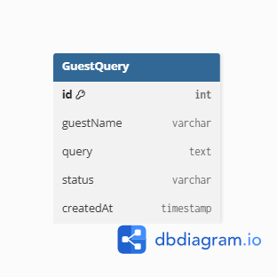

# Sejoura – AI-Powered Guest Support Assistant

## Project Overview

Sejoura is an AI-powered web application developed for homestay owners and eco-tourism businesses. It helps automate guest support by managing guest queries and providing a centralized system for handling customer interactions. The application reduces repetitive customer inquiries and improves response efficiency.

---

## Features

* Manage guest queries
* Create, view, update, and delete guest queries (CRUD)
* Search guest queries by status
* Responsive React frontend
* RESTful API built with Express.js
* PostgreSQL database hosted on Supabase
* Prisma ORM for database operations
* Dark/Light mode support

---

## Tech Stack

### Frontend

* React
* TypeScript
* Tailwind CSS
* React Router

### Backend

* Node.js
* Express.js

### Database

* PostgreSQL (Supabase)

### ORM

* Prisma

---

## Database Choice

PostgreSQL was selected because Sejoura manages structured guest information with clearly defined fields. PostgreSQL provides reliable relational storage, while Prisma simplifies database access with an easy-to-use ORM.

---

## Database Schema

The application currently contains one primary entity:

**GuestQuery**



---

## REST API Endpoints

| Method | Endpoint                            | Description                |
| ------ | ----------------------------------- | -------------------------- |
| GET    | /api/queries                        | Get all guest queries      |
| GET    | /api/queries/:id                    | Get a specific guest query |
| POST   | /api/queries                        | Create a guest query       |
| PUT    | /api/queries/:id                    | Update a guest query       |
| DELETE | /api/queries/:id                    | Delete a guest query       |
| GET    | /api/queries/search?status=answered | Search guest queries       |

---

## Environment Variables

Create a `.env` file inside the backend directory.

```env
DATABASE_URL=your_pooler_connection
DIRECT_URL=your_direct_connection
PORT=5000
```

---

## Database Setup

1. Clone the repository.

2. Navigate to the backend directory.

3. Install dependencies.

```bash
npm install
```

4. Generate the Prisma Client.

```bash
npx prisma generate
```

5. Run database migrations.

```bash
npx prisma migrate dev
```

6. Start the backend server.

```bash
npm run dev
```

---

## Running the Frontend

```bash
cd frontend
npm install
npm run dev
```

---

## Future Improvements

* AI-powered guest chatbot using Gemini API
* Authentication for homestay owners
* Knowledge Base Management
* Conversation Analytics Dashboard
* FAQ Management
* Multi-homestay support
