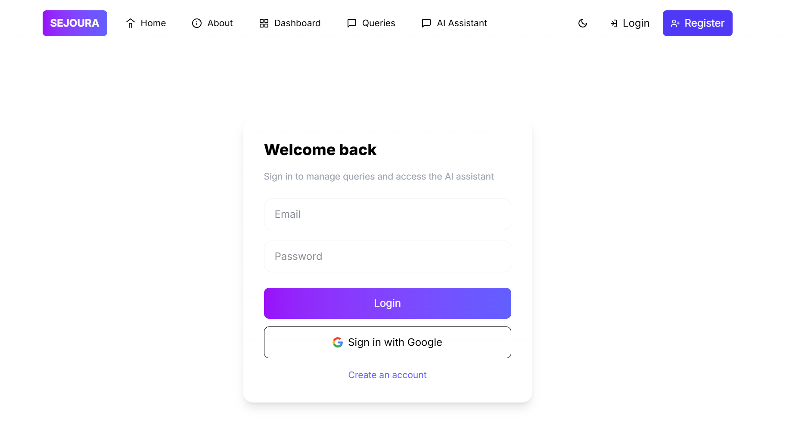
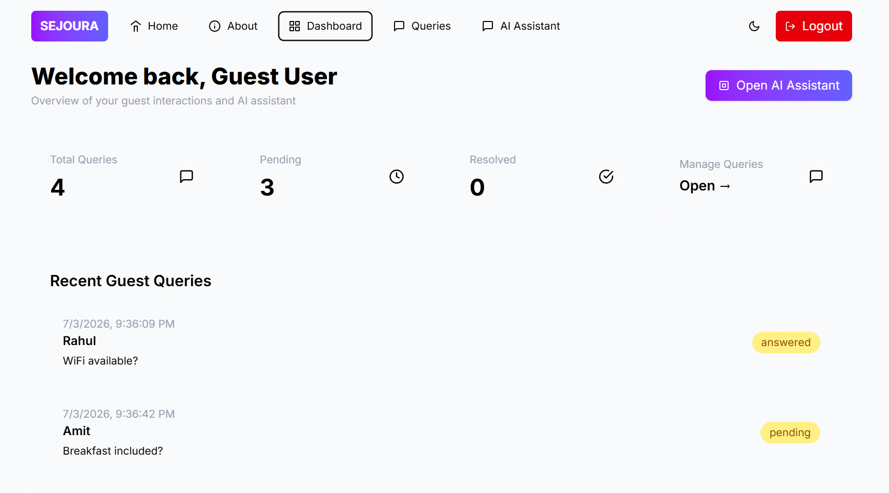
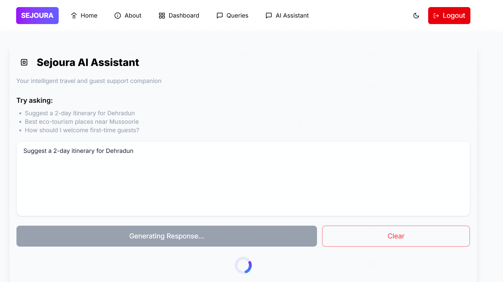
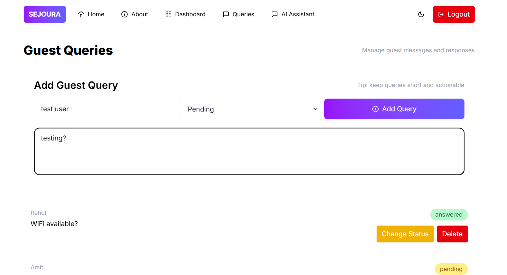

# 🏡 Sejoura – AI-Powered Guest Support Platform

Sejoura is a full-stack web application that helps homestays and hospitality providers manage guest queries efficiently using Artificial Intelligence. The platform allows secure user authentication, guest query management, AI-powered travel assistance, and real-time interaction through a modern web interface.

---

## 🌐 Live Demo

**Frontend:**  
https://sejoura-frontend.vercel.app

**Backend API:**  
https://sejoura-backend.onrender.com

---

## 📸 Screenshots

### Home Page



### Dashboard



### AI Assistant



### Guest Queries



---

## ✨ Features

- 🔐 Secure User Authentication (JWT)
- 🌐 Google OAuth Login
- 🤖 AI-powered Guest Support Assistant using Google Gemini
- 📝 Guest Query Management (CRUD)
- 📊 Interactive Dashboard
- 🌙 Dark / Light Theme
- 📱 Responsive Design
- ⚡ RESTful API with Express.js
- 🗄️ PostgreSQL Database using Prisma ORM
- 🚀 Deployed on Vercel and Render

---

## 🛠️ Tech Stack

### Frontend

- React
- TypeScript
- Vite
- Tailwind CSS
- React Router

### Backend

- Node.js
- Express.js
- Prisma ORM
- JWT Authentication
- Passport.js
- Google OAuth

### Database

- PostgreSQL (Supabase)

### AI

- Google Gemini API

### Deployment

- Vercel
- Render

---
## 📂 Project Structure

```
Sejoura
│
├── frontend/                 # React + TypeScript + Vite
│   ├── src/
│   ├── public/
│   └── package.json
│
├── backend/                  # Express.js API
│   ├── prisma/
│   ├── src/
│   │   ├── controllers/
│   │   ├── middleware/
│   │   ├── routes/
│   │   ├── services/
│   │   └── server.js
│   └── package.json
│
└── README.md
```

---

## ⚙️ Installation & Setup

### 1. Clone the Repository

```bash
git clone https://github.com/YOUR_GITHUB_USERNAME/Sejoura.git

cd Sejoura
```

---

### 2. Setup Backend

```bash
cd backend

npm install
```

Create a `.env` file inside the backend folder:

```env
DATABASE_URL=your_database_url

DIRECT_URL=your_direct_database_url

JWT_SECRET=your_secret_key

GOOGLE_CLIENT_ID=your_google_client_id

GOOGLE_CLIENT_SECRET=your_google_client_secret

GEMINI_API_KEY=your_gemini_api_key

CLIENT_URL=http://localhost:5173
```

Run the backend:

```bash
npm run dev
```

---

### 3. Setup Frontend

```bash
cd frontend

npm install
```

Create a `.env` file:

```env
VITE_API_URL=http://localhost:5000
```

Run the frontend:

```bash
npm run dev
```

---

## 🔐 Environment Variables

### Backend

| Variable | Description |
|----------|-------------|
| DATABASE_URL | PostgreSQL database connection |
| DIRECT_URL | Direct database connection for Prisma |
| JWT_SECRET | Secret key used for JWT |
| GOOGLE_CLIENT_ID | Google OAuth Client ID |
| GOOGLE_CLIENT_SECRET | Google OAuth Client Secret |
| GEMINI_API_KEY | Google Gemini API Key |
| CLIENT_URL | Frontend URL |

---

### Frontend

| Variable | Description |
|----------|-------------|
| VITE_API_URL | Backend API URL |

---
## 📡 API Documentation

### Authentication

| Method | Endpoint | Description |
|--------|----------|-------------|
| POST | `/api/auth/register` | Register a new user |
| POST | `/api/auth/login` | Login user and receive JWT |
| GET | `/api/auth/google` | Login with Google OAuth |

---

### Guest Queries

| Method | Endpoint | Description |
|--------|----------|-------------|
| GET | `/api/queries` | Get all guest queries |
| GET | `/api/queries/:id` | Get a query by ID |
| POST | `/api/queries` | Create a new guest query |
| PUT | `/api/queries/:id` | Update an existing guest query |
| DELETE | `/api/queries/:id` | Delete a guest query |

---

### AI Assistant

| Method | Endpoint | Description |
|--------|----------|-------------|
| POST | `/api/ai/chat` | Generate an AI response using Google Gemini |

---

### Sample Login Request

```http
POST /api/auth/login
```

```json
{
  "email": "user@example.com",
  "password": "password123"
}
```

### Sample Response

```json
{
  "message": "Login successful",
  "token": "JWT_TOKEN"
}
```

---

## 🏗️ Architecture

```
React + TypeScript
        │
        ▼
React Router + Tailwind CSS
        │
        ▼
Express.js REST API
        │
        ▼
Prisma ORM
        │
        ▼
PostgreSQL (Supabase)
        │
        ▼
Google Gemini API
```

---

## 🤖 AI Assistant

The Sejoura AI Assistant is powered by the Google Gemini API.

Users can ask questions related to:

- Travel planning
- Homestays
- Tourist attractions
- Guest support
- Local recommendations

The backend securely communicates with the Gemini API and returns AI-generated responses to the frontend.

---

## ⚠️ Known Limitations

- Render free tier may take 30–60 seconds to wake up after inactivity.
- Google Gemini API usage depends on the available free quota.
- Google OAuth requires an internet connection and valid OAuth credentials.
- The application currently supports email/password and Google authentication.

---

## 🚀 Future Enhancements

- Real-time notifications
- AI-powered sentiment analysis for guest feedback
- Booking and reservation management
- Admin analytics dashboard
- Multi-language AI support
- Email notifications

---

## 🙏 Credits & Acknowledgements

This project was developed as part of the **AI-Assisted Full Stack Web Development Internship (TBI-GEU)**.

Technologies and services used:

- React
- TypeScript
- Tailwind CSS
- Node.js
- Express.js
- Prisma ORM
- PostgreSQL (Supabase)
- Google Gemini AI
- Google OAuth
- Vercel
- Render

Special thanks to the internship program for providing the project roadmap and learning objectives.

---

## 📄 License

This project is intended for educational and portfolio purposes.